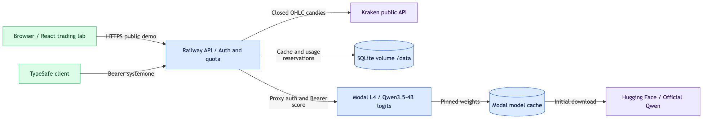

# jev뇨띠 · jev-nyotti

**For educational purposes only.** No order execution or demonstrated profitability.

[Live website](https://jt.memtherscan.xyz) · [Hugging Face adapter](https://huggingface.co/guzus/jev-nyotti) · [GitHub](https://github.com/guzus/jev-nyotti) · [API schema](https://jt.memtherscan.xyz/openapi.json)

Qwen3.5-4B 실제 logits를 사용하는 **TypeSafe/Jev 호환 API**와 한국어 시장 분석 웹사이트. Railway는 웹·API를, Modal L4는 모델을 서빙합니다. 공개 서비스는 사용자가 제공한 AOA 매매내역으로 학습한 [BTC 포지션 모방 LoRA 파일럿](training/REAL_DATA.md)을 사용합니다. 이전 포지션을 없음으로 가정한 1시간 후 롱·숏·무포지션 상대 점수이며, BTC 시간봉 학습을 다른 Kraken 시장·봉 간격에 적용하는 교육용 실험입니다. 단순히 이전 포지션을 유지하는 기준선을 넘지 못했고 수익성은 검증되지 않았습니다. 원본의 거래자 신원은 독립적으로 검증하지 않았습니다. 주문 실행 기능은 없습니다.



[Editable Excalidraw](diagrams/runtime.excalidraw) · [Mermaid](diagrams/runtime.mmd) · [Evidence](diagrams/runtime.evidence.json)

## Run locally

Node.js 24+ is required. Copy `.env.example` to ignored `.env`; set a random 32+ character `API_KEY`. Set the Modal URL, inference key and proxy token pair to enable the real model. No credentials enter the browser bundle.

```sh
npm ci
npm run build
node --env-file=.env dist/server/index.js
```

Without an inference endpoint, the site shows actual market data and a model-unavailable state. It never synthesizes an analysis. For frontend development, export the environment and run `npm run dev`.

## Interfaces

| Interface | Purpose |
|---|---|
| `POST /v1/systemone` | Bearer-authenticated choice, score and noul classification |
| `POST /v1/trading/decisions` | Bearer-authenticated market research stance |
| `GET /v1/models` | Actual model identity |
| `GET /openapi.json` | API discovery and request schemas |
| Website `/` | Global-volume top 10 snapshot × 15m/1h/4h charts and shareable decisions |
| `GET /healthz` | Gateway liveness without waking the GPU |

Use `Qwen/Qwen3.5-4B` as the client model. This preserves TypeSafe's wire format, not Jev's weights or calibration. Chat completions are not implemented. See [API semantics and examples](docs/api.md).

## Model and operations

- Official pinned revision: `851bf6e806efd8d0a36b00ddf55e13ccb7b8cd0a`.
- Modal L4: 0 minimum / 1 maximum container, 60-second idle scale-down; model cache persists. Cold-start latency includes loading weights.
- Every candidate is scored through verified single-token labels. Conditional softmax scores are **not calibrated probabilities of returns**. Confidence is 1 minus normalized entropy.
- Actual Kraken closed candles only; stale, invalid and gapped data is rejected. No order execution, exchange credentials or trader history.
- SQLite on Railway retains immutable shares for 30 days, daily quotas and the refresh queue across deploys. With `SCHEDULED_ANALYSIS_ENABLED=true`, one worker checks all ten displayed coins × three intervals every ten minutes, reuses identical closed-candle snapshots, and retains the last result when refresh fails. Slow upstream calls can delay the serial queue. Page views and public analysis requests never start inference. Keep one Railway replica.
- `MODEL_TRAINING_STATUS=action_v1` switches to the [ACTION_V1](training/ACTION_V1.md) stateful mode. It makes one 15-minute paper action per coin (관망/롱 진입/숏 진입/추가/축소/청산) from a carried SQLite paper position. Each cutoff is applied once and never backfilled. Fees are 7.5 bps per unit. BTC is in-distribution; the other coins are untested transfer. No orders are executed. See [API semantics](docs/api.md#action_v1-stateful-mode).
- Scheduled production cap: 5,000 classification questions/day, shared with authenticated `/v1/systemone` requests. Failed model calls also consume quota. Thirty scheduled checks every ten minutes yield at most 4,320 checks/day; unchanged candles skip inference (normally about 1,260 new snapshots/day across these intervals). HTTP reads have separate rate limits. This is **not a dollar spending cap**; GPU idle time, CPU/memory and storage also consume credit, and Railway billing is separate.

**Stateful action model (2026-09-23):** [ACTION_V1](training/ACTION_V1.md) and [ACTION_V2](training/ACTION_V2.md) both failed their pre-registered gates, so the `action_v1` server mode, `/action` endpoint and stateful replay are shipped but **not active**. Production still serves the model above.

[Training: real-data pilot and rehearsal](training/README.md) · [Deployment and recovery](docs/deployment.md) · [Inference service](inference/README.md) · [Future dataset/evaluation plan](docs/experiment.md)

## Verify

```sh
npm run typecheck
npm run build
npm test
uv venv inference/.venv
uv pip install --python inference/.venv/bin/python -r inference/requirements-dev.txt
PYTHONPATH=inference inference/.venv/bin/pytest inference/tests
```

Tests inject explicit test engines; production has no mock-model setting. Deployment checks separately verify real model revision/logits, market cutoffs, share links and browser behavior.

Earlier [vendor comparisons](docs/provider-landscape.md) and [serving research](docs/serving.md) predate the selected **Qwen3.5-4B + Modal** configuration. They are historical research, not current deployment instructions or approval to purchase training.

The coin picker uses the [dated CoinGecko global 24-hour USD volume snapshot](docs/volume-ranking.json), excluding its stablecoin category: BTC, ETH, XRP, SOL, DOGE, BNB, SUI, NEAR, PEPE, ZEC. This is a fixed snapshot with its timestamp visible in the UI, not an automatically refreshed ranking. Chart and inference inputs remain Kraken USD spot candles. Previously shared ADA/AVAX/LINK/DOT/LTC results remain supported.

### Historical PnL

The homepage reads `GET /api/performance`. No historical inference is triggered by this endpoint. Until an operator imports a real replay, it returns `status: pending` and the UI displays no invented return.

Build, then run `node dist/server/pnl-import.js INPUT.json /data` on the service filesystem to atomically publish `pnl-report.json`. Keep raw inputs outside git. Input has `model`, pinned `revision`, ISO `generatedAt`, `source`, `priorPolicy: "previous_prediction"`, and `series`. Each series contains a unique `symbol`, hourly `decisions` (`marketAsOf`, `action`, `previousAction`) and matching execution `candles` (`time` in UNIX seconds, OHLC and volume). The decision cutoff is the preceding input candle close and the execution candle open. The importer requires a contiguous common range, starts flat, and validates the entire prior-position chain. Publication time must follow the final candle close. This CLI does not generate decisions.

Defaults: $10,000 split equally at inception, entry notional capped at sleeve equity, quantity retained until the side changes, 5 bps fee and 2 bps adverse slippage per fill. Funding, borrowing, liquidation and terminal closing costs are not modeled; insolvency is rejected. Curves use hourly closing marks. Buy-and-hold includes entry costs on the same capital/range. These are retrospective simulations, not executed trades or guaranteed out-of-sample results.

Historical replay is **paused after the model failed to beat position persistence and remained flat in inspected replay decisions**. The GPU worker and automatic publication were stopped. The intended cadence was every four hours with a $10 compute allowance, processing a recent contiguous window first. See the [corrective diagnostic experiment](training/TRANSITION_DIAGNOSTIC.md). `reports/replay-provenance.json` records the exact published range and completion count; this is not a completed five-year result. Coins without a complete common history need an explicit availability/cash-allocation policy before portfolio import; never synthesize pre-listing prices. Live cached decisions assume a flat prior and must not be relabeled as a carried-position replay. Production has no synthetic PnL fixture.

The importer also accepts the unit-based ACTION_V1 replay format. See [docs/api.md](docs/api.md#action_v1-stateful-mode).

Published replay artifacts live under `reports/` and ship with the app. `/data/pnl-report.json` overrides a bundled report only when it exists. The UI exposes a latest-first per-symbol decision history alongside PnL. Input remains hourly; model prediction horizon remains one hour and the explicit holding cadence is four hours. Source is Binance Spot USDT, distinct from the live Kraken USD chart.
