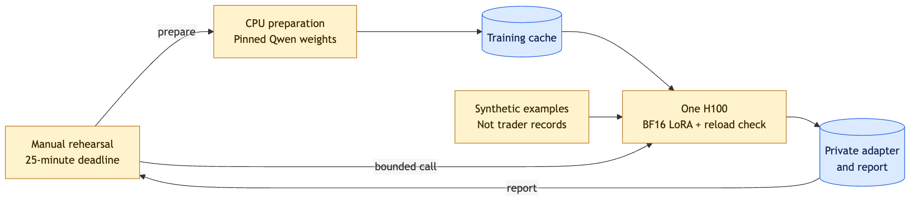

# Qwen3.5-4B training

For the user-supplied execution export, see [the real-data pilot](REAL_DATA.md). Its task and chronological evaluation are separate from this synthetic rehearsal.

A manual synthetic-data smoke test for the training pipeline. It does **not** train on 워뇨띠 records, demonstrate a profitable trading strategy, or update the live website/API. Public inference continues to serve the original base checkpoint.

[Measured rehearsal results — 2026-09-22](RESULTS.md): real H100 training, exported LoRA and exact post-reload parity verified.



[Editable diagram](../diagrams/training.excalidraw) · [Evidence](../diagrams/training.evidence.json)

## Run

From the repository root, with the existing Modal profile authenticated:

```sh
modal run training/modal_rehearsal.py
# Optional shorter dispatch-to-cancellation deadline (seconds):
modal run training/modal_rehearsal.py --gpu-budget-seconds 1200
```

This incurs Modal compute charges. The entrypoint first downloads the pinned public model on CPU, then runs one H100 with BF16 LoRA (rank 16). It supervises only the single answer token, using the exact inference prompt formatter and verified label-token boundary. Vision weights and the base model remain frozen.

The rehearsal generates 192 deterministic training examples and 12 distinct evaluation examples, with 24 synthetic candles each. A simple, explicitly stated rule determines long/short/hold; option ordering is shuffled. Scores on this task only check the plumbing and cannot measure trading ability. Real training requires a verified historical dataset, reconstructed decision-time context and chronological validation.

## Runtime and cost controls

- One GPU container; at most 100 optimizer steps, batch 2 × accumulation 2.
- CPU preparation is capped at 15 minutes and completes before the GPU deadline starts.
- The GPU call receives an immutable deadline 25 minutes after dispatch by default; `--gpu-budget-seconds` can shorten it (60–1,500 seconds). The caller cancels the call and terminates its container on completion, timeout or interruption. Count retries against the original session's remaining budget.
- Child execution is capped at 21 minutes or the remaining deadline minus 30 seconds, whichever is shorter. The child stops starting training steps after 1,000 seconds so it can save and check the adapter.
- Function timeout: 22 minutes; startup timeout: 2 minutes. Application retries: zero. The absolute deadline also covers infrastructure rescheduling.
- Use `modal run` in attached mode. Do not deploy this function or remove the deadline. To stop a particular active run, use the app ID printed by Modal: `modal app stop <run-app-id> --yes`.
- These controls bound this rehearsal's runtime, not account-wide spending. Other apps can consume the same credits. H100 is estimated at $0.001097/second; CPU, RAM, startup and storage are additional. Estimates are not billing records.

The training image is separate from the inference image: Unsloth's supported Transformers version currently differs from production's. No inference secrets are mounted. Model download cache and rehearsal artifacts use separate Modal Volumes (`jev-qwen-training-cache` and `jev-qwen-training-rehearsals`).

## Artifacts and checks

The command prints a run ID and writes a local report to `.runtime/training/<run-id>/report.json`. The private artifact Volume contains `<run-id>/adapter/`, `events.jsonl` and `report.json`. Download an adapter explicitly with:

```sh
mkdir -p .runtime/training/<run-id>
modal volume get jev-qwen-training-rehearsals <run-id>/adapter .runtime/training/<run-id>
```

To recheck an existing export without repeating training, use a shorter budget within the original session's remaining allowance:

```sh
modal run training/modal_rehearsal.py --gpu-budget-seconds 600 --verify-run-id <source-run-id>
```

This writes a new report with `source_run_id` and leaves the original run's status intact. The shared loader creates a fresh revision-pinned base, allocates FP32 adapter parameters before copying the FP32 checkpoint (`autocast_adapter_dtype=True`), then applies Unsloth's post-load patches. Disabling that option can round checkpoint values through BF16 before casting them back to FP32.

The report records package/model revisions, sample lengths, loss, actual optimizer steps, peak VRAM, measured tokens/second after five warm-up steps, adapter hashes, changed tensors and post-reload logits. Training metrics are persisted before reload, and a failed reload records its error in the Volume even though the CLI exits unsuccessfully. Validation compares tensor keys, shapes, dtypes and raw bytes in memory, on disk and after reload onto a fresh pinned base. Both evaluations use Unsloth's inference mode, the same inputs and disabled KV cache; the maximum allowed logit difference is less than 0.15 and choices must match exactly. Matching scores there does not establish compatibility with the production inference environment; that remains a separate promotion check.

```sh
PYTHONPATH=inference:training python -m unittest discover -s training/tests -v
```

The local tests cover deterministic labels, held-out fixture separation, response-only loss masking, length overflow rejection and tokenizer-boundary rejection. The GPU run separately validates the real tokenizer, finite gradients, changed weights, saved tensors and identical post-reload choices.

Sources: [Unsloth Qwen3.5 guide](https://unsloth.ai/docs/models/qwen3.5/fine-tune), [Modal pricing](https://modal.com/pricing), [rescheduling behavior](https://modal.com/docs/guide/retries), [call cancellation](https://modal.com/docs/sdk/py/latest/FunctionCall#cancel).
