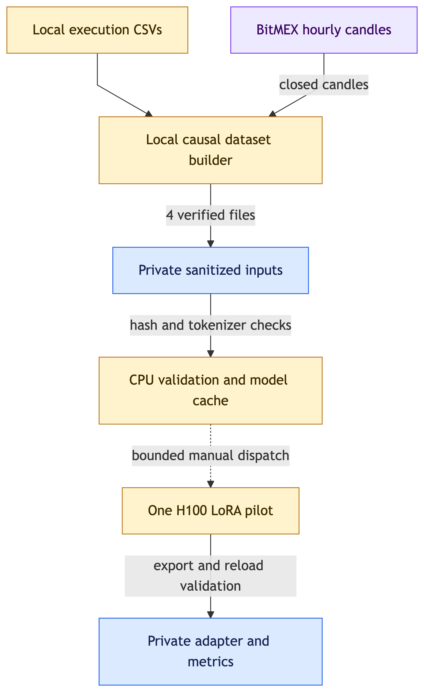

# Real-data pilot: next-hour BTC position side

This pilot uses the user-supplied AOA execution export to imitate **long / short / flat XBTUSD exposure after the next hour**. It does not learn the trader's reasoning, establish profitability, or replace the live website's base model. The production spot-direction task has different inputs and labels and needs a separate evaluation before promotion.



[Editable diagram](../diagrams/training-real.excalidraw) · [Evidence](../diagrams/training-real.evidence.json)

[Measured pilot results](REAL_DATA_RESULTS.md): training/export passed; no improvement over position persistence.

## Data construction

`real_data.py` requires Python 3.11+ and the four execution CSV files. It sorts fills by execution time, accumulates signed contract quantities (Buy positive, Sell negative), and checks reconstructed absolute positions against every BTC funding record. Funding does not change the position. At equal timestamps funding checks precede fills, and position queries use strictly earlier fills. Partial fills are naturally summed without relying on order IDs. Zero opening exposure is an explicit assumption supported by all 3,961 BTC funding checks.

The source contains 1,444,583 execution rows across 46 instruments; this pilot uses 941,007 BTC trades and 3,961 BTC funding records. Wallet exports, account/order/execution identifiers and arbitrary source text do not enter model inputs. Source attribution is supplied by the user and has not been independently authenticated.

**Timestamp interpretation:** execution timestamps have no timezone metadata. This pilot interprets them as UTC. After dataset creation, an independent local comparison corroborated this with three official historical funding timestamp/rate matches across 2018 and 2021 (CSV commission normalized by position sign). Two rates were unique in their surrounding daily windows, distinguishing UTC from 8-hour shifts; one repeated rate is weaker evidence. All 3,961 BTC funding clocks also match the official 04:00/12:00/20:00 UTC schedule. This is strong corroboration, not explicit export metadata. Sources: [BitMEX contract guide](https://www.bitmex.com/app/perpetualContractsGuide), [2018 funding response](https://www.bitmex.com/api/v1/funding?symbol=XBTUSD&startTime=2018-03-04T00%3A00%3A00Z&endTime=2018-03-07T00%3A00%3A00Z&count=20&reverse=false), [2021 January response](https://www.bitmex.com/api/v1/funding?symbol=XBTUSD&startTime=2020-12-31T00%3A00%3A00Z&endTime=2021-01-03T00%3A00%3A00Z&count=20&reverse=false), [2021 July response](https://www.bitmex.com/api/v1/funding?symbol=XBTUSD&startTime=2021-06-30T00%3A00%3A00Z&endTime=2021-07-03T00%3A00%3A00Z&count=20&reverse=false). The original dataset manifest remains unchanged.

Market data comes from the official [BitMEX bucketed-trade API](https://docs.bitmex.com/api-explorer/get-trade-bucketed): 33,649 complete hourly buckets from 2018-03-01 through 2022-01-01 inclusive. Timestamps denote bucket ends. Only buckets ending at or before the decision cutoff are used; actual publication latency at the boundary is not modeled. BitMEX's open equals the previous close and can fall outside the current bucket's high/low. Volume is contracts, each with [USD 1 face value](https://www.bitmex.com/app/contract/XBTUSD), not BTC.

Inputs contain 24 recent closed candles, features calculated from up to 96 completed hours, and the position side before the cutoff. Targets use fills strictly before cutoff + 1 hour. No target-window fills, prices or account balances enter the input. Samples outside observed execution coverage are excluded.

| Split | Period | Sample size | Position changes |
|---|---|---:|---:|
| Train | 2018–2020 | 4,096 | 173 |
| Validation | 2021 first half, after 96-hour purge | 128 | 2 |
| Test | 2021 second half, after 96-hour purge | 128 | 1 |

Samples are deterministic uniform samples within chronological partitions. Feature windows do not cross partition boundaries. Validation/test contain no flat targets. The tiny number of transitions makes this a training-pipeline pilot, **not evidence of a useful trading strategy**. Reports compare the base and tuned model with the previous-position persistence baseline, include action-space confusion matrices, and report transition counts explicitly. Option order is shuffled; metrics map token indices back to long/short/flat. Chronological isolation applies to this fine-tuning dataset; unknown base-model pretraining may already contain historical market information, so it does not establish a prospective test.

## Prepare and run

Keep raw data outside git. Downloaded candles, generated datasets and adapter artifacts belong under ignored `.runtime/` directories. Preparation refuses to overwrite an existing dataset version.

```sh
python3.12 training/fetch_market.py --output-dir .runtime/real-training
python3.12 training/real_data.py \
  --source /path/to/aoa_public_2021-12-31_with_letter \
  --candles .runtime/real-training/bitmex-xbtusd-1h.jsonl \
  --output .runtime/real-training/pilot-v1

# Requires an authenticated Modal profile, Modal 1.5.5 and Pydantic 2.x.
python3.12 -m modal run training/modal_real.py \
  --dataset-dir .runtime/real-training/pilot-v1
```

The [pilot manifest](REAL_DATA_MANIFEST.json) records source/content hashes, reconciliation, periods, distributions and assumptions. Only `train.jsonl`, `validation.jsonl`, `test.jsonl` and `manifest.json` are uploaded to the private `jev-qwen-real-pilot-inputs` Volume. Hash, schema, chronology, option mapping, identifier-field and symlink checks run before upload and again on workers. CPU preparation also validates the real tokenizer and token lengths before allocating a GPU.

## Approved pilot budget and output

The authorized run budget is **at most $5**. One H100 runs BF16 LoRA rank 16 on the pinned Qwen3.5-4B revision. At most 1,024 optimizer steps use batch 2 × accumulation 2. Training stops starting steps after 1,200 seconds, leaving time for fixed evaluations and export/reload checks. An immutable 1,800-second dispatch deadline, child-process timeout and explicit container cancellation bound GPU execution. CPU preparation is capped at 900 seconds. There are no application retries or automatic follow-up runs.

Configured maximum compute is conservatively estimated at **$2.23**, leaving margin for startup and overhead under the $5 pilot allowance. This is based on [Modal's published rates](https://modal.com/pricing) checked 2026-09-22, not a billing invoice or account-wide spending cap. Keep attached mode; do not deploy this training app. On interruption the caller cancels containers; verify the printed app has stopped. Any manual recovery must count prior spend against the same $5 allowance.

Reports and FP32 LoRA exports live in private `jev-qwen-real-pilot-artifacts/<run-id>/`. The local report is `.runtime/training/<run-id>/report.json`. Export verification compares adapter tensor bytes in memory, on disk and after loading a fresh pinned base, then compares logits and choices on 12 fixed validation inputs. It establishes compatibility with the training runtime only.

```sh
mkdir -p .runtime/training/<run-id>
modal volume get jev-qwen-real-pilot-artifacts \
  <run-id>/adapter .runtime/training/<run-id>
PYTHONPATH=inference:training python3.12 -m unittest discover -s training/tests -v
```

Create the local destination directory before a recursive Modal CLI download; files should land in its `adapter/` child. Verify every downloaded file against `adapter_files` in the report.
